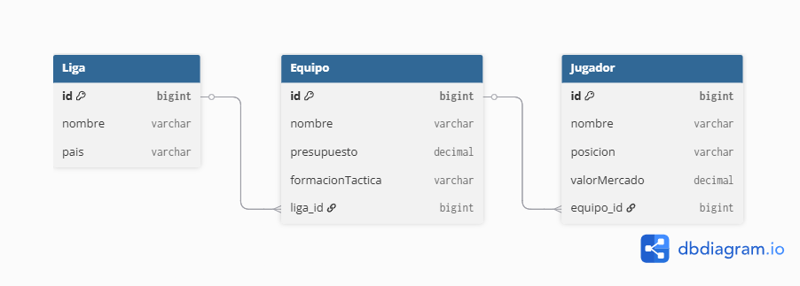

# API REST - Gestión de Clubes de Fútbol (Modo Manager)

Este proyecto es una API REST desarrollada para la gestión y simulación táctica de clubes de fútbol. Permite administrar ligas, equipos y jugadores, aislando por completo la persistencia del contrato de exposición pública mediante buenas prácticas de diseño arquitectónico.

## 🚀 Stack Tecnológico
* **Java 21** (LTS)
* **Spring Boot 3.5**
* **Maven** (Gestor de dependencias)
* **MySQL / MariaDB** (vía XAMPP)
* **Lombok** (Reducción de código boilerplate)
* **MapStruct** (Mapeo automatizado de DTOs en tiempo de compilación)
* **Jakarta Validation** (Validación de datos de entrada)

---

## 🏗️ Arquitectura y Patrón de Capas
La aplicación sigue el patrón de diseño arquitectónico en capas para asegurar la separación de responsabilidades:
1. **Controller:** Capa de presentación encargada de recibir peticiones HTTP, validar los datos de entrada y estructurar las respuestas.
2. **Service:** Capa central que encapsula la lógica de negocio pura y coordina las transacciones e interacciones entre componentes.
3. **Repository / Model:** Capa encargada del mapeo objeto-relacional (ORM) y la persistencia directa de datos en la base de datos relacional.

### 🛡️ Patrón DTO (Data Transfer Object)
Siguiendo las mejores prácticas de seguridad y desacoplamiento, las entidades JPA nunca se exponen directamente en los endpoints. Se utilizan DTOs independientes mapeados de forma eficiente con MapStruct:
* **`RequestDTO`:** Captura y valida la información enviada por el cliente antes de ser procesada por el servicio.
* **`ResponseDTO`:** Estructura un JSON limpio y seguro hacia el exterior, evitando bucles de serialización infinita en relaciones bidireccionales.

---

## 📊 Modelo de Datos (DER)
El sistema gestiona tres entidades principales con relaciones Lazy de alto rendimiento para optimizar la memoria y el tráfico de red:
* **Liga:** Relación OneToMany hacia Equipos.
* **Equipo:** Relación ManyToOne con Liga y OneToMany hacia Jugadores.
* **Jugador:** Relación ManyToOne con Equipo.
 


---

## 🔌 Endpoints de la API

### Ligas (`/api/ligas`)
* `POST /api/ligas` - Crea una nueva liga (Retorna `201 Created`).
* `GET /api/ligas` - Recupera el listado de todas las ligas (Retorna `200 OK`).
* `PUT /api/ligas/{id}` - Modifica el nombre o país de una liga existente (Retorna `200 OK`).
* `DELETE /api/ligas/{id}` - Elimina una liga y sus equipos en cascada (Retorna `204 No Content`).

### Equipos (`/api/equipos`)
* `POST /api/equipos` - Registra un equipo vinculándolo a una liga mediante `ligaId` (Retorna `201 Created`).
* `GET /api/equipos` - Lista todos los equipos y muestra el nombre de su liga correspondiente (Retorna `200 OK`).

### Jugadores (`/api/jugadores`)
* `POST /api/jugadores` - Inscribe un jugador con su posición táctica y valor de mercado en un club (`equipoId`) (Retorna `201 Created`).
* `GET /api/jugadores` - Obtiene el listado completo de los futbolistas registrados (Retorna `200 OK`).

---

## 🛠️ Ejecución en Entorno Local

1. Activa los módulos **Apache** y **MySQL** en tu panel de **XAMPP**.
2. Crea una base de datos vacía llamada `club_db` desde phpMyAdmin.
3. Abre el proyecto en **Visual Studio Code**.
4. Ejecuta el siguiente comando en la terminal para compilar los mappers de MapStruct y levantar el servidor de desarrollo:
   ```bash
   .\mvnw clean spring-boot:run